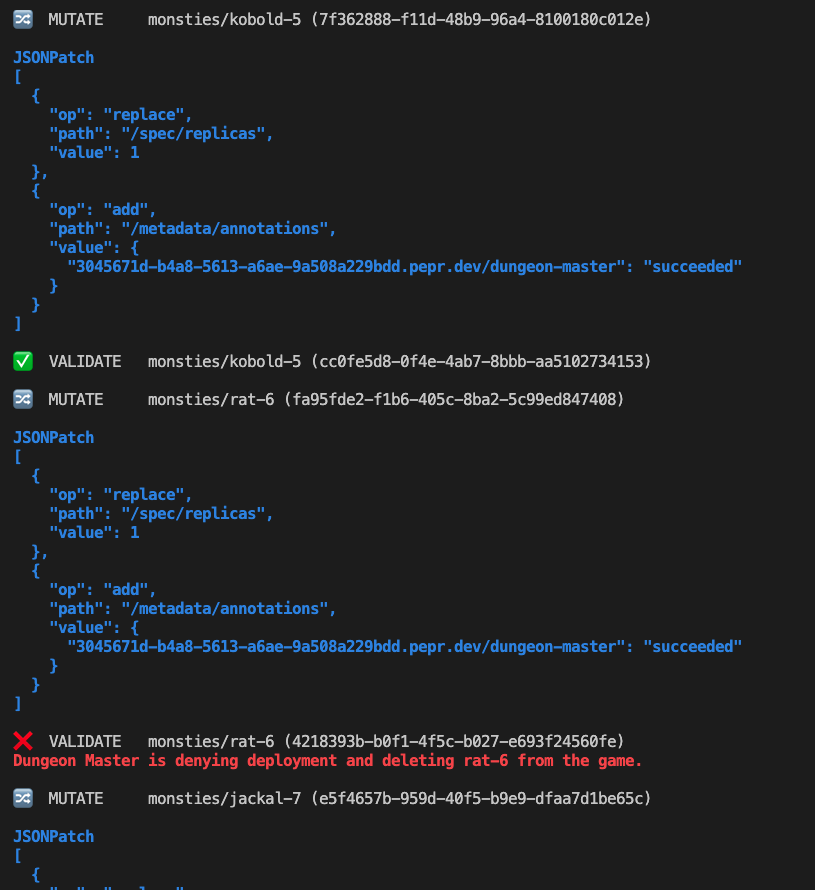
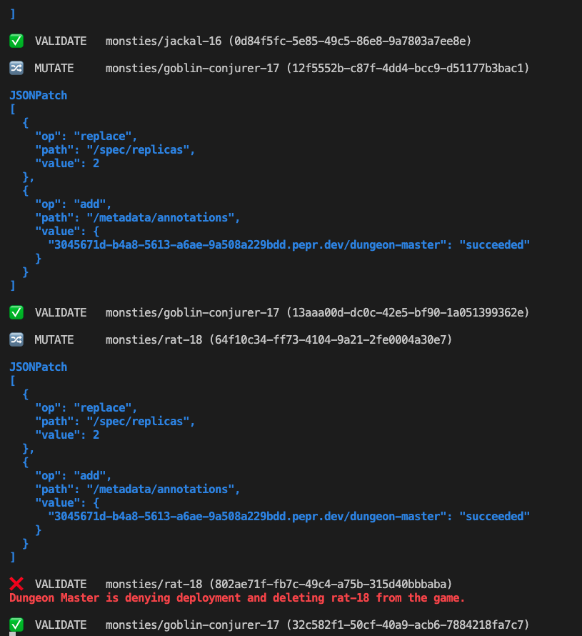

# Pepr Dungeon Crawl


## Play the classic roguelike dungeon crawler BrogueCE in your Kubernetes cluster with Pepr acting as the dungeon master to validate and mutate your game/Kubernetes objects

</br>
</br>

**Demo Video - Part 1**

https://github.com/schaeferka/pepr-dungeon-crawl/assets/49598208/23b2cf32-e970-46d0-a051-6f31bd1c3c9a


</br>

**Demo Video - Part 2**

https://github.com/schaeferka/pepr-dungeon-crawl/assets/49598208/e4cf6bea-bb37-48e6-9639-f6a02cbfa299


</br>

**Pepr Monitor view from `npx pepr monitor` near start of game**


</br>

**Pepr Monitor view from `npx pepr monitor` near end of game**


</br>

## Introduction

Lately I've been spending a lot of time working with [Pepr](https://github.com/defenseunicorns/pepr) and [Kubernetes](https://kubernetes.io). Along the way, I ran into [KubeDoom](https://github.com/storax/kubedoom) which inspired me to find a fun way to explore how Pepr interacts with a cluster using validating and mutating webhooks. The result of this exploration was Pepr Dungeon Crawl.

## Table of Contents

- [Pepr Dungeon Crawl](#pepr-dungeon-crawl)
  - [Play the classic roguelike dungeon crawler BrogueCE in your Kubernetes cluster with Pepr acting as the dungeon master to validate and mutate your game/Kubernetes objects](#play-the-classic-roguelike-dungeon-crawler-broguece-in-your-kubernetes-cluster-with-pepr-acting-as-the-dungeon-master-to-validate-and-mutate-your-gamekubernetes-objects)
  - [Introduction](#introduction)
  - [Table of Contents](#table-of-contents)
  - [Overview](#overview)
  - [Features](#features)
    - [TODO](#todo)
  - [Installation](#installation)
    - [Prerequisites](#prerequisites)
    - [Installation Steps](#installation-steps)
  - [Play Pepr Dungeon Crawl](#play-pepr-dungeon-crawl)
  - [Tips](#tips)

## Overview

Pepr Dungeon Crawl is made up of two main components: the BrogueCE game and the Pepr Dungeon Master.

The BrogueCE - Pepr Edition game is a deployment that runs a modified version of the classic roguelike dungeon crawler [BrogueCE](https://github.com/tmewett/BrogueCE).

The Pepr Dungeon Master is a Pepr module that uses validating and mutating webhooks to interact with the Brogue game deployment. [Pepr](https://github.com/defenseunicorns/pepr) is a tool that allows you to easily build and deploy Kubernetes validating and mutating webhooks using a TypeScript file with easy to understand plain-English syntax.

## Features

- Run a modified version of the classic roguelike dungeon crawler Brogue in your Kubernetes cluster
- Monsters in the game are represented by Kubernetes deployments
- Killing monsters in the game will delete the corresponding deployment in the cluster
- Deleting deployments in the cluster will kill the corresponding monster in the game
- Pepr Dungeon Master module uses validating and mutating webhooks to interact with the Brogue game deployment
- Pepr Dungeon Master module will prevent unwanted monsters from being deployed in the cluster, and will delete the in-game monster when the deployment is rejected. The included configuration will prevent the deployment of "rat", "pink-jelly", and "pit-bloat" monsters  and will delete them from the game.
- The number of pods for each monster deployment will be mutated to equal to the dungeon level on which it was created. For example, a "kobold" monster deployment created on dungeon level 3 will have 3 pods.

### TODO

- [ ] Represent the player character as a Kubernetes deployment
- [ ] Represent player inventory as Kubernetes objects
- [ ] Add a "secret" level that will create monsters to represent other objects in the cluster
- [ ] Add additional options for adjusting the number of pods for each monster deployment.
- [ ] Update `brogue-pepr-edition/src/client/deploymentAction.js` to use [kubernetes-fluent-client](https://github.com/defenseunicorns/kubernetes-fluent-client).

## Installation

### Prerequisites

- A Kubernetes cluster. If you don't have a cluster, you can create one using [k3d](https://k3d.io) with the following command:

  ```bash
  k3d cluster create
  ```

- kubectl installed and configured to use your cluster. If you don't have kubectl installed, you can install it using [Homebrew](https://brew.sh) with the following command:

  ```bash
  brew install kubectl
  ```

### Installation Steps

1. Clone this repository:

  ```bash
  git clone https://github.com/schaeferka/pepr-dungeon-crawl.git
  ```

2. Change to the `pepr-dungeon-crawl` directory:

  ```bash
  cd pepr-dungeon-crawl
  ```

3. Update the hostpath the `pepr-dungeon-master/manifests/pepr-dungeon-crawl-deployment.yaml` file to match the path to the `pepr-dungeon-crawl` directory on your system.
<br />

4. Change to the `pepr-dungeon-master/pepr` directory:

  ```bash
  cd pepr-dungeon-master/pepr
  ```

5. Deploy the Pepr Dungeon Master module to your cluster:

  ```bash
  npx pepr build
  ```

6. Return to the root of the `pepr-dungeon-crawl` directory:

  ```bash
  cd ../..
  ```

7. Use the deploy script to apply the manifests to your cluster:

  ```bash
  ./deploy.sh
  ```

8. Wait for the BrogueCE - Pepr Edition game and the Pepr Dungeon Master module to be deployed to your cluster. When the deployments are ready, you should see `Forwarding from [::1]:5900 -> 5900` in the terminal.

## Play Pepr Dungeon Crawl

After deploying both the BrogueCE - Pepr Edition game and the Pepr Dungeon Master module as described above, you're ready to play Pepr Dungeon Crawl.

To start the game, start a VNC viewer and connect to `localhost:5900`. If using the provided image, the password is `pepr`.

Once connected, open a terminal and run the following command to start the game:

```bash
./brogue
```

## Tips

- **Having trouble staying alive in the game?** Use the `--wizard` flag when starting the game from a terminal to enable wizard mode (makes you invincible and gives you starting items that make the game easier to play):

  ```bash
  ./brogue --wizard
  ```

- **Can't stand certain types of monsters?** Adjust the Pepr Dungeon Master module to prevent them from being deployed in the cluster and delete them from the game. The initial configuration of the Pepr Dungeon Master module is in the `pepr-dungeon-master` directory of this repository.

- **See a monster in the game that you really don't want to fight?** Delete the corresponding deployment in the cluster to kill the monster in the game. For example, to delete the "kobold-8" monster deployment, run the following command:

  ```bash
  kubectl delete deployment kobold-8
  ```
